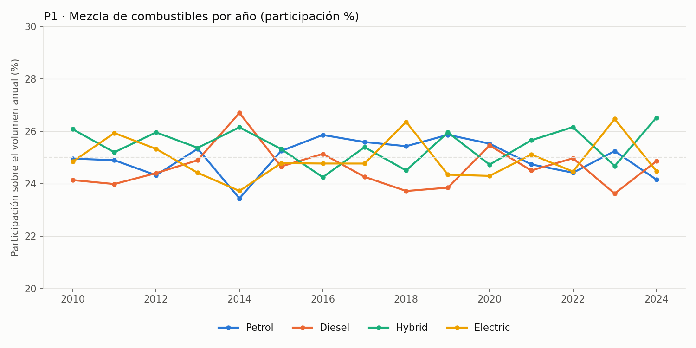
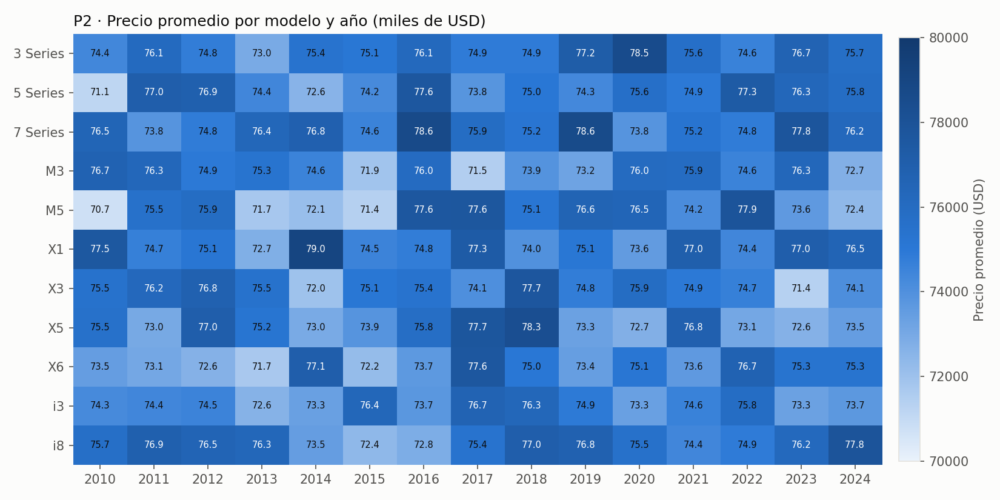
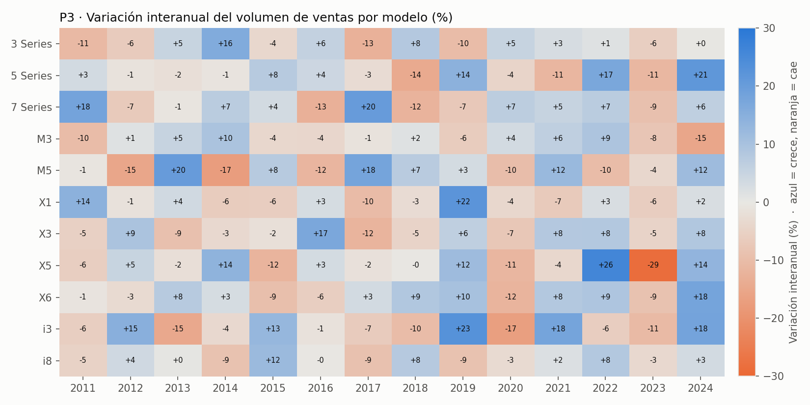
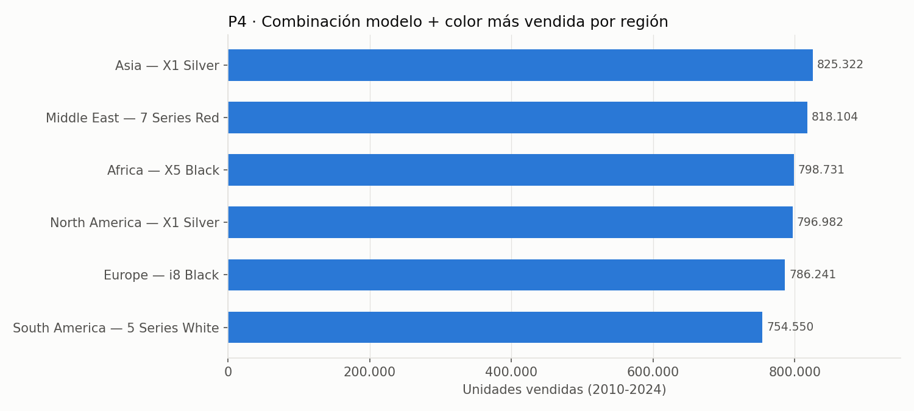
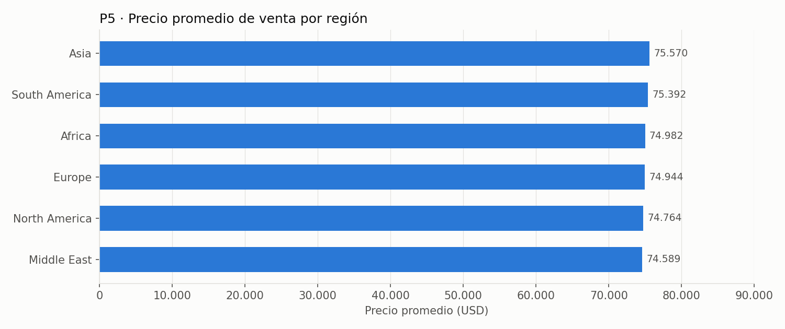

# Dashboard Analítico: Modelo Estrella Ventas BMW (`dw_bmw_ventas`)

> **Aclaración sobre la lectura de los datos.** El dataset de Kaggle tiene una distribución prácticamente uniforme (es decir que parece generado sintéticamente): casi todas las diferencias entre categorías son chicas. Por eso en cada pregunta se indica qué diferencias son reales y cuáles están dentro del ruido.

---

## Pregunta 1: ¿Cómo cambió la mezcla de combustibles vendidos a lo largo de los años?

```sql
SELECT t.anio, c.tipo_combustible, SUM(h.volumen_ventas) AS total_ventas
FROM Hecho_Ventas h
JOIN Dim_Tiempo t       ON h.id_tiempo = t.id_tiempo
JOIN Dim_Combustible c  ON h.id_combustible = c.id_combustible
GROUP BY t.anio, c.tipo_combustible
ORDER BY t.anio, c.tipo_combustible;
```

La columna `participacion_%` es el indicador "Participación % por tipo de combustible" (`total_ventas / total del año × 100`), calculado en la capa de BI sobre el resultado de la consulta.

|anio|tipo_combustible|total_ventas|participacion_%|
|---|---|---|---|
|2010|Diesel|4086808|24.13|
|2010|Electric|4205554|24.84|
|2010|Hybrid|4415611|26.08|
|2010|Petrol|4225472|24.95|
|2011|Diesel|4019361|23.98|
|2011|Electric|4345538|25.93|
|2011|Hybrid|4222305|25.19|
|2011|Petrol|4171737|24.89|
|2012|Diesel|4087221|24.4|
|2012|Electric|4242466|25.33|
|2012|Hybrid|4347806|25.95|
|2012|Petrol|4074402|24.32|
|2013|Diesel|4198426|24.89|
|2013|Electric|4117556|24.41|
|2013|Hybrid|4278494|25.37|
|2013|Petrol|4272257|25.33|
|2014|Diesel|4527336|26.7|
|2014|Electric|4022785|23.72|
|2014|Hybrid|4434340|26.15|
|2014|Petrol|3974499|23.44|
|2015|Diesel|4193633|24.65|
|2015|Electric|4215113|24.78|
|2015|Hybrid|4307029|25.32|
|2015|Petrol|4294432|25.25|
|2016|Diesel|4262129|25.13|
|2016|Electric|4199882|24.77|
|2016|Hybrid|4111145|24.24|
|2016|Petrol|4384394|25.86|
|2017|Diesel|4031905|24.26|
|2017|Electric|4116302|24.77|
|2017|Hybrid|4219927|25.39|
|2017|Petrol|4252677|25.59|
|2018|Diesel|3892638|23.72|
|2018|Electric|4325544|26.36|
|2018|Hybrid|4021011|24.5|
|2018|Petrol|4173080|25.43|
|2019|Diesel|4099576|23.85|
|2019|Electric|4184558|24.34|
|2019|Hybrid|4461759|25.95|
|2019|Petrol|4446063|25.86|
|2020|Diesel|4152177|25.46|
|2020|Electric|3962571|24.29|
|2020|Hybrid|4032718|24.72|
|2020|Petrol|4163377|25.53|
|2021|Diesel|4137203|24.5|
|2021|Electric|4239630|25.11|
|2021|Hybrid|4331469|25.65|
|2021|Petrol|4176364|24.73|
|2022|Diesel|4474126|24.97|
|2022|Electric|4383912|24.46|
|2022|Hybrid|4687463|26.16|
|2022|Petrol|4375445|24.42|
|2023|Diesel|3842804|23.62|
|2023|Electric|4305554|26.47|
|2023|Hybrid|4013825|24.67|
|2023|Petrol|4106471|25.24|
|2024|Diesel|4356475|24.85|
|2024|Electric|4290700|24.48|
|2024|Hybrid|4647195|26.51|
|2024|Petrol|4233484|24.15|



**Lectura:** la mezcla casi no cambió. Los cuatro combustibles se mueven entre 23,4 % y 26,7 % del volumen anual, sin una tendencia sostenida: no hay un desplazamiento de combustión hacia híbrido o eléctrico. Híbrido es el que tiene mayor participación promedio (25,5 %) y cierra 2024 como líder (26,5 %); Diésel y Nafta no muestran caída sostenida.

---

## Pregunta 2: ¿Cuál es el precio promedio de venta por modelo y por año?

```sql
SELECT t.anio, p.modelo, ROUND(AVG(h.precio_usd), 2) AS precio_promedio
FROM Hecho_Ventas h
JOIN Dim_Tiempo t     ON h.id_tiempo = t.id_tiempo
JOIN Dim_Producto p   ON h.id_producto = p.id_producto
GROUP BY t.anio, p.modelo
ORDER BY t.anio, p.modelo;
```

El resultado tiene 165 filas (11 modelos × 15 años; completo en `resultados/pregunta2.csv`). Se muestra pivotado (modelo × año) para que sea legible; los valores son exactamente los de la consulta.

|modelo|2010|2011|2012|2013|2014|2015|2016|2017|2018|2019|2020|2021|2022|2023|2024|
|---|---|---|---|---|---|---|---|---|---|---|---|---|---|---|---|
|3 Series|74360.49|76071.26|74785.89|72953.81|75368.0|75066.3|76145.18|74881.28|74864.34|77187.41|78529.48|75633.42|74582.22|76652.49|75706.45|
|5 Series|71147.38|77045.3|76897.73|74402.79|72574.61|74222.3|77613.2|73822.52|75005.98|74306.73|75643.02|74931.03|77317.29|76325.58|75825.12|
|7 Series|76501.16|73830.81|74827.31|76354.79|76845.65|74551.47|78641.35|75866.26|75186.66|78596.44|73848.4|75237.7|74834.04|77754.89|76225.21|
|I3|74255.14|74382.56|74500.28|72595.89|73338.38|76352.11|73748.07|76654.42|76330.95|74912.24|73325.86|74593.87|75838.33|73285.81|73674.25|
|I8|75699.24|76910.5|76528.36|76331.7|73458.72|72357.02|72848.61|75385.54|77017.64|76811.04|75536.16|74388.91|74880.94|76168.77|77825.82|
|M3|76701.92|76298.56|74929.6|75287.03|74555.9|71904.44|76014.45|71481.55|73903.19|73210.0|76042.73|75946.29|74557.62|76291.68|72725.66|
|M5|70739.24|75510.86|75896.53|71728.98|72115.71|71387.02|77603.06|77636.65|75115.37|76566.27|76478.49|74167.68|77882.22|73602.85|72379.41|
|X1|77541.29|74665.42|75148.49|72742.99|79039.0|74514.11|74769.17|77272.05|73950.53|75053.42|73552.3|76966.09|74406.81|76999.59|76534.27|
|X3|75453.46|76229.32|76795.33|75461.46|71992.18|75054.23|75379.22|74055.32|77670.07|74770.01|75874.17|74941.94|74676.02|71361.11|74065.19|
|X5|75534.06|72985.77|77041.01|75198.48|72963.27|73853.34|75798.88|77697.39|78315.29|73302.2|72708.28|76849.08|73068.19|72643.12|73466.98|
|X6|73463.96|73071.49|72640.22|71684.51|77052.66|72198.6|73664.83|77609.76|75011.46|73425.99|75146.6|73622.69|76692.45|75274.11|75274.07|



**Lectura:** el precio promedio se mantiene en una banda angosta, entre USD 70.739 (M5, 2010) y USD 79.039 (X1, 2014). No hay inflación de precios ni un modelo que se despegue sistemáticamente de los demás.

---

## Pregunta 3: ¿Qué modelos perdieron ventas y cuáles crecieron (variación interanual)?

```sql
WITH VentasAnuales AS (
    SELECT t.anio, p.modelo, SUM(h.volumen_ventas) AS volumen_actual
    FROM Hecho_Ventas h
    JOIN Dim_Tiempo t    ON h.id_tiempo = t.id_tiempo
    JOIN Dim_Producto p  ON h.id_producto = p.id_producto
    GROUP BY t.anio, p.modelo
)
SELECT v1.anio AS anio_actual, v1.modelo,
       v2.volumen_actual AS ventas_anio_anterior,
       v1.volumen_actual AS ventas_anio_actual,
       ROUND(((v1.volumen_actual - v2.volumen_actual) / v2.volumen_actual) * 100, 2) AS variacion_porcentual
FROM VentasAnuales v1
JOIN VentasAnuales v2 ON v1.modelo = v2.modelo AND v1.anio = v2.anio + 1
ORDER BY v1.modelo, v1.anio;
```

El resultado tiene 154 filas (11 modelos × 14 variaciones; completo en `resultados/pregunta3.csv`). Se muestra la columna `variacion_porcentual` pivotada (modelo × año):

|modelo|2011|2012|2013|2014|2015|2016|2017|2018|2019|2020|2021|2022|2023|2024|
|---|---|---|---|---|---|---|---|---|---|---|---|---|---|---|
|3 Series|-10.6|-6.45|5.11|16.16|-3.69|5.65|-12.54|8.19|-9.88|5.32|2.71|1.43|-5.69|0.05|
|5 Series|3.4|-1.04|-2.08|-0.86|7.73|4.44|-2.74|-14.22|14.31|-4.39|-11.38|17.21|-11.22|21.33|
|7 Series|18.07|-6.74|-0.6|7.04|3.51|-12.87|20.23|-11.97|-7.06|7.0|5.24|7.06|-8.93|6.46|
|I3|-5.78|14.83|-14.64|-3.51|12.81|-1.27|-6.51|-9.98|22.91|-16.74|17.92|-6.03|-10.51|18.13|
|I8|-4.83|3.93|0.3|-8.57|12.03|-0.15|-8.81|7.87|-8.52|-2.85|1.99|8.21|-3.49|3.36|
|M3|-9.99|1.47|5.39|9.53|-3.55|-3.79|-1.09|1.61|-6.21|3.51|6.42|9.23|-7.89|-15.09|
|M5|-0.61|-15.22|20.38|-17.23|7.56|-11.68|17.96|7.45|3.22|-9.73|12.4|-10.03|-3.7|11.59|
|X1|14.47|-1.38|3.57|-6.12|-5.96|3.04|-10.11|-2.73|22.17|-3.74|-6.71|2.51|-5.87|2.5|
|X3|-5.18|9.39|-9.12|-3.32|-1.83|16.95|-11.85|-4.62|6.36|-7.42|8.15|8.29|-4.52|8.44|
|X5|-5.81|5.06|-1.94|13.98|-11.89|3.16|-1.59|-0.17|11.57|-11.31|-3.64|25.87|-28.51|13.56|
|X6|-0.81|-2.88|7.69|2.91|-9.23|-5.85|3.41|8.52|10.2|-11.87|8.28|8.94|-8.54|17.99|



**Lectura:** ningún modelo crece ni cae de forma sostenida: todos alternan años positivos y negativos (entre 5 y 8 años de crecimiento sobre 14). Comparando extremos del período (2010 vs 2024), los que más crecieron son **X6 (+26,6 %)**, **7 Series (+21,5 %)** y **5 Series (+14,0 %)**; los que más cayeron son **M3 (−13,2 %)**, **3 Series (−8,3 %)** y **X5 (−3,8 %)**. La mayor suba puntual fue X5 en 2022 (+25,9 %) y la mayor caída, X5 en 2023 (−28,5 %). Como la serie es muy volátil, el 2010 vs 2024 es un indicio, no una tendencia firme.

---

## Pregunta 4: ¿Qué combinación de color + modelo es más popular en cada región?

```sql
WITH RankCombinaciones AS (
    SELECT r.nombre_region, p.modelo, c.nombre_color,
           SUM(h.volumen_ventas) AS total_ventas,
           ROW_NUMBER() OVER (PARTITION BY r.nombre_region ORDER BY SUM(h.volumen_ventas) DESC) AS ranking
    FROM Hecho_Ventas h
    JOIN Dim_Region r    ON h.id_region = r.id_region
    JOIN Dim_Producto p  ON h.id_producto = p.id_producto
    JOIN Dim_Color c     ON h.id_color = c.id_color
    GROUP BY r.nombre_region, p.modelo, c.nombre_color
)
SELECT nombre_region, modelo, nombre_color, total_ventas
FROM RankCombinaciones
WHERE ranking = 1;
```

|nombre_region|modelo|nombre_color|total_ventas|
|---|---|---|---|
|Africa|X5|Black|798731|
|Asia|X1|Silver|825322|
|Europe|I8|Black|786241|
|Middle East|7 Series|Red|818104|
|North America|X1|Silver|796982|
|South America|5 Series|White|754550|



**Lectura:** cada región tiene una combinación líder distinta; X1 Silver se repite en Asia y Norteamérica. Los totales de las seis ganadoras van de 754.550 a 825.322 unidades, así que las diferencias de popularidad son moderadas.

---

## Pregunta 5: ¿Cómo varía el precio promedio según región?

```sql
SELECT r.nombre_region, ROUND(AVG(h.precio_usd), 2) AS precio_promedio
FROM Hecho_Ventas h
JOIN Dim_Region r ON h.id_region = r.id_region
GROUP BY r.nombre_region
ORDER BY precio_promedio DESC;
```

|nombre_region|precio_promedio|
|---|---|
|Asia|75570.08|
|South America|75391.67|
|Africa|74982.44|
|Europe|74944.27|
|North America|74763.78|
|Middle East|74589.44|



**Lectura:** el precio es casi idéntico entre regiones: la diferencia entre la más cara (Asia, USD 75.570) y la más barata (Middle East, USD 74.589) es de unos USD 980, aproximadamente 1,3 %. El eje del gráfico parte de cero para no exagerar esa diferencia.

---

## Nota metodológica

- `precio_usd` en `Hecho_Ventas` ya es el promedio del grupo (año, modelo, región, combustible, color). Los `AVG` de las preguntas 2 y 5 son entonces promedios de promedios, sin ponderar por volumen. Es una consecuencia de la granularidad elegida en el Paso 2; para este análisis la diferencia es marginal.
- Los modelos `i3` e `i8` figuran como `I3` / `I8` en las dimensiones por el `str.title()` del ETL; en los gráficos se muestran con su nombre original.