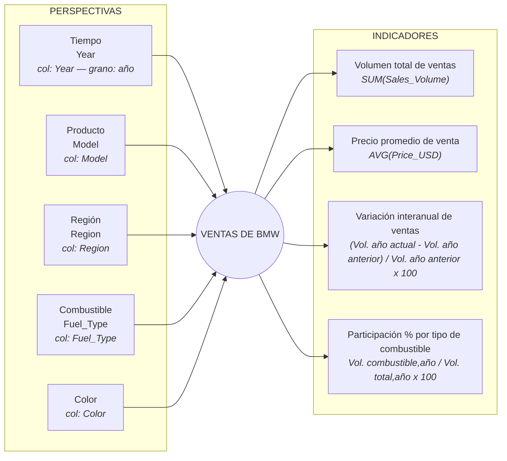

# Entrega Fuente de Datos: Ventas Vehículos BMW (2010-2024)

**Integrantes:** Santino Vazquez de Novoa, Enzo Parra, Santiago Dhers, Tomas Vogt

**Punto de partida:** modelo conceptual y preguntas de negocio de `entrega_requerimientos.md` (Paso 1).

**Archivo analizado:** `BMW_sales_data__2010-2024_.csv` — 50.000 filas, 11 columnas. El dataset que utilizamos de Kaggle no incluye un diccionario de datos, por lo que el significado y tipo de cada columna lo dedujimos inspeccionando los valores del archivo.

---

## 1. Perfil del archivo

| Columna | Descripción | Valores / rango | Tipo de dato |
|---|---|---|---|
| `Model` | Modelo de vehículo BMW vendido | 11 valores: `3 Series`, `5 Series`, `7 Series`, `M3`, `M5`, `X1`, `X3`, `X5`, `X6`, `i3`, `i8` | Categórica (texto) |
| `Year` | Año calendario en que se realizó la venta | 2010–2024 (15 valores) | Numérica (entero, año) |
| `Region` | Región geográfica donde se realizó la venta | 6 valores: `Africa`, `Asia`, `Europe`, `Middle East`, `North America`, `South America` | Categórica (texto) |
| `Color` | Color del vehículo vendido | 6 valores: `Black`, `Blue`, `Grey`, `Red`, `Silver`, `White` | Categórica (texto) |
| `Fuel_Type` | Tipo de combustible del vehículo | 4 valores: `Petrol`, `Diesel`, `Hybrid`, `Electric` | Categórica (texto) |
| `Transmission` | Tipo de transmisión del vehículo | 2 valores: `Automatic`, `Manual` | Categórica (texto) |
| `Engine_Size_L` | Tamaño del motor, en litros | 1.5 – 5.0 | Numérica (decimal) |
| `Mileage_KM` | Kilometraje del vehículo al momento de la venta | 3 – 199.996 | Numérica (entero) |
| `Price_USD` | Precio de venta, en dólares | 30.000 – 119.998 | Numérica (entero) |
| `Sales_Volume` | Cantidad de unidades vendidas correspondientes a ese registro (es la medida del hecho, no "1 fila = 1 auto") | 100 – 9.999 | Numérica (entero) |
| `Sales_Classification` | Clasificación de la venta, **derivada** de `Sales_Volume` | 2 valores: `High` (si `Sales_Volume ≥ 7000`), `Low` (si `Sales_Volume < 7000`) | Categórica (texto) |
---

## 2. a) Conformar indicadores

| Indicador (Paso 1) | Hecho(s) | Fórmula | Función de agregación |
|---|---|---|---|
| Volumen total de ventas | `Sales_Volume` | `SUM(Sales_Volume)` | `SUM` |
| Precio promedio de venta | `Price_USD` | `AVG(Price_USD)` | `AVG` |
| Variación interanual de ventas | `Sales_Volume`, agrupado por `Year` | (`SUM(Sales_Volume)` año actual − `SUM(Sales_Volume)` año anterior) / `SUM(Sales_Volume)` año anterior × 100 | `SUM` (base) + cálculo derivado entre años consecutivos |
| Participación % por tipo de combustible | `Sales_Volume`, agrupado por `Fuel_Type` y `Year` | `SUM(Sales_Volume)` [`Fuel_Type = x`, `Year = y`] / `SUM(Sales_Volume)` [`Year = y`] × 100 | `SUM` (base) + cociente |

---

## 3. b) Establecer correspondencias

| Elemento del modelo conceptual | Tipo | Columna(s) real(es) del archivo |
|---|---|---|
| Tiempo | Perspectiva | `Year` |
| Producto | Perspectiva | `Model` |
| Región | Perspectiva | `Region` |
| Combustible | Perspectiva | `Fuel_Type` |
| Color | Perspectiva | `Color` |
| Volumen total de ventas | Indicador | `Sales_Volume` (`SUM`) |
| Precio promedio de venta | Indicador | `Price_USD` (`AVG`) |
| Variación interanual de ventas | Indicador | `Sales_Volume` (`SUM`) + `Year` (agrupación temporal) |
| Participación % por tipo de combustible | Indicador | `Sales_Volume` (`SUM`) + `Fuel_Type` + `Year` |

---

## 4. c) Nivel de granularidad

- **Tiempo → `Year`:** en este caso, es la única columna temporal disponible en el archivo (no hay mes, trimestre ni día), entonces el nivel de agrupamiento queda fijado en **año**. Por ende no nos va a ser posible tener mas profundidad en cuanto a la variable temporal.
- **Producto → `Model`:** es la única columna que va a identificar el producto vendido y la usaremos en las preguntas 2, 3 y 4.
- **Región → `Region`:** se incluye tal cual (6 valores). Requerida para las preguntas 4 y 5.
- **Color → `Color`:** se incluye tal cual (6 valores). Requerida para la pregunta 4.
- **Combustible → `Fuel_Type`:** se incluye tal cual (4 valores). Requerida por la pregunta 1 
- **Columnas fuera de alcance:** `Transmission`, `Engine_Size_L`, `Mileage_KM` y `Sales_Classification` no se incorporan como perspectivas ni indicadores en esta iteración — ninguna de las 5 preguntas del Paso 1 las requiere. `Sales_Classification`, además, es un campo derivado de `Sales_Volume` (umbral `≥ 7000` = `High`), por lo que sumarlo sería redundante con el indicador "Volumen total de ventas" ya definido. Quedan documentadas como ideas para una futura pregunta (ver Paso 1).

**Consistencia de valores de texto:** se compararon las 6 columnas categóricas contra su versión sin espacios y en minúsculas. El número de valores únicos no cambió en ninguna, por lo que no logramos detectar ninguna inconsistencia (variantes de escritura, mayúsculas mezcladas, espacios extra). No se requiere en este caso de normalización de texto ni de mapeo manual.

---

## 5. d) Modelo conceptual ampliado

