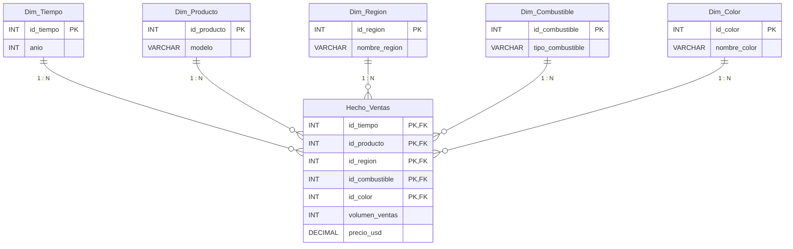

# Paso 3 — Modelo Lógico del DW (HEFESTO)

## a) Tipo de Modelo Lógico

El dataset y los requerimientos del proyecto responden a un único proceso analítico de negocio: las ventas de vehículos BMW. Por lo tanto, la elección es usar un **modelo en estrella**, ya que:

- No hay jerarquías normalizadas complejas: ninguna de las 5 perspectivas seleccionadas (Tiempo, Producto, Región, Combustible, Color) tiene estructuras internas que ameriten desglosarse en tablas secundarias (no hay, por ejemplo, una jerarquía Región → País → Ciudad).
- Se trata de un único proceso de negocio (ventas), no de varios procesos que compartan dimensiones, por lo que no se justifica una constelación de hechos.
- El modelo en estrella minimiza el número de combinaciones de tablas (joins) necesarias en las consultas de inteligencia de negocios, optimizando la velocidad de cálculo e integración de los indicadores analíticos.

## b) Tablas de Dimensiones

**1. Dim_Tiempo**
- `id_tiempo` (PK, Entero): clave primaria artificial (surrogate key).
- `anio` (Entero): año calendario de la venta, derivado de la columna original `Year`.

**2. Dim_Producto**
- `id_producto` (PK, Entero): clave primaria artificial (surrogate key).
- `modelo` (Varchar): modelo del vehículo BMW, derivado de la columna original `Model`.

**3. Dim_Region**
- `id_region` (PK, Entero): clave primaria artificial (surrogate key).
- `nombre_region` (Varchar): región geográfica de la venta, derivada de la columna original `Region`.

**4. Dim_Combustible**
- `id_combustible` (PK, Entero): clave primaria artificial (surrogate key).
- `tipo_combustible` (Varchar): tipo de combustible del vehículo, derivado de la columna original `Fuel_Type`.

**5. Dim_Color**
- `id_color` (PK, Entero): clave primaria artificial (surrogate key).
- `nombre_color` (Varchar): color del vehículo, derivado de la columna original `Color`.

## c) Tabla de Hechos

Se define una tabla de hechos central denominada **Hecho_Ventas**:

- **Nombre de la tabla:** `Hecho_Ventas`.
- **Clave Primaria Compuesta (PK):** integrada por las 5 claves foráneas de las dimensiones relacionadas: `(id_tiempo, id_producto, id_region, id_combustible, id_color)`.
- **Claves Foráneas (FK):**
  - `id_tiempo` → referencia a `Dim_Tiempo.id_tiempo`.
  - `id_producto` → referencia a `Dim_Producto.id_producto`.
  - `id_region` → referencia a `Dim_Region.id_region`.
  - `id_combustible` → referencia a `Dim_Combustible.id_combustible`.
  - `id_color` → referencia a `Dim_Color.id_color`.
- **Campos de Medidas Base (Hechos):**
  - `volumen_ventas` (Entero): medida proveniente de `Sales_Volume`. Permite calcular el Volumen total de ventas (`SUM`), la Variación interanual de ventas y la Participación % por tipo de combustible.
  - `precio_usd` (Decimal): medida proveniente de `Price_USD`. Permite calcular el Precio promedio de venta (`AVG`).

> **Nota metodológica HEFESTO (indicadores derivados):** la Variación interanual y la Participación % no se persisten como columnas en la tabla de hechos, sino que se calculan dinámicamente en la capa de BI a partir de las agregaciones sumarias de `volumen_ventas` agrupadas por las dimensiones correspondientes.

> **Nota metodológica HEFESTO (grano y colisión de claves):** dado que el grano de `Hecho_Ventas` es la combinación `(año, modelo, región, combustible, color)`, y el archivo original tiene 50.000 filas para un espacio de combinaciones posibles mucho menor (16 años × 11 modelos × 6 regiones × 4 combustibles × 6 colores ≈ 25.344 combinaciones), es esperable que **varias filas del archivo original compartan la misma clave compuesta**. Esto se resuelve en el Paso 4 agregando esas filas en una sola fila de hechos: `volumen_ventas` se suma (`SUM`) y `precio_usd` se promedia (`AVG`) entre todas las filas originales que caen en la misma combinación, antes de insertar en `Hecho_Ventas`.

## d) Uniones y Diagrama del Modelo Lógico Final

La tabla de hechos central `Hecho_Ventas` se vincula mediante relaciones de 1 a N (1 en la dimensión, N en la tabla de hechos) con cada una de las 5 tablas de dimensiones.

