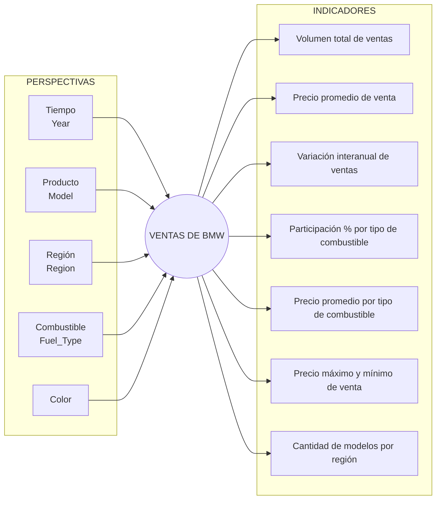

# Entrega Requerimientos: Ventas Vehículos BMW (2010-2024)

**Integrantes:** Santino Vazquez de Novoa, Enzo Parra, Santiago Dhers, Tomas Vogt

---

## 1. Presentación del tema y la fuente de datos

**Tema elegido:** Ventas de vehículos BMW a nivel global en el período 2010-2024.

**Proceso de negocio a analizar:** Todos los años, BMW vende sus distintos modelos en mercados de todo el mundo, y cada venta involucra un conjunto de decisiones previas: qué modelo se ofrece, con qué motor y combustible, qué transmisión, en qué color, a qué precio y en qué región. Con el correr de los años esas decisiones van cambiando: la empresa lanza modelos nuevos, ajusta precios y potencia la venta de híbridos o eléctricos según la región. El resultado de todo eso debe resumirse en cuánto se vendió y qué tan bien le fue a cada venta, es decir, se busca clasificar las ventas para impulsar mercados regionales que puedan no estar funcionando, encontrar patrones de compra en base a región y paso del tiempo, y detectar cambios en los precios.

**Fuente del archivo:**
- **Portal:** Kaggle
- **Dataset:** *Comprehensive BMW Sales Records and Market Trends (2010–2024)*
- **URL:** https://www.kaggle.com/datasets/y0ussefkandil/bmw-sales2010-2024
- **Fecha de descarga:** 09/09/2026

**Descripción general del contenido:** el archivo contiene 50.000 registros de ventas de BMW entre 2010 y 2024, con los siguientes campos por registro:

- `Model` — modelo vendido
- `Year` — año de la venta
- `Region` — región donde se vendió
- `Color` — color del vehículo
- `Fuel_Type` — tipo de combustible
- `Transmission` — tipo de transmisión
- `Engine_Size_L` — tamaño del motor
- `Mileage_KM` — kilometraje
- `Price_USD` — precio en dólares
- `Sales_Volume` — volumen de ventas
- `Sales_Classification` — clasificación de la venta

---

## 2. Identificar preguntas

1. ¿Cómo cambió la mezcla de combustibles vendidos a lo largo de los años (combustión vs. híbrido vs. eléctrico)?
2. ¿Cuál es el precio promedio de venta por modelo y por año?
3. ¿Qué modelos "envejecieron" (perdieron ventas) y cuáles crecieron sostenidamente en el período analizado?
4. ¿Qué combinación de color + modelo es más popular en cada región?
5. ¿Cómo varía el precio promedio según región?

---

## 3. Indicadores y perspectivas

### Pregunta 1: ¿Cómo cambió la mezcla de combustibles vendidos a lo largo de los años (combustión vs. híbrido vs. eléctrico)?

**Indicadores:**
- Volumen total de ventas (`SUM(Sales_Volume)`)
- Participación porcentual de cada tipo de combustible sobre el total del año (`Volumen del combustible / Volumen total del año`)

**Perspectivas:**
- Tiempo → `Year`
- Combustible → `Fuel_Type` (Petrol, Diesel, Hybrid, Electric)

### Pregunta 2: ¿Cuál es el precio promedio de venta por modelo y por año?

**Indicadores:**
- Precio promedio (`AVG(Price_USD)`)

**Perspectivas:**
- Producto → `Model`
- Tiempo → `Year`

### Pregunta 3: ¿Qué modelos "envejecieron" (perdieron ventas) y cuáles crecieron sostenidamente en el período analizado?

**Indicadores:**
- Volumen total de ventas (`SUM(Sales_Volume)`)
- Variación interanual de ventas (`Volumen año actual − Volumen año anterior`, o variación % año a año)

**Perspectivas:**
- Producto → `Model`
- Tiempo → `Year`

### Pregunta 4: ¿Qué combinación de color + modelo es más popular en cada región?

**Indicadores:**
- Volumen total de ventas

**Perspectivas:**
- Producto → `Model`
- Color → `Color`
- Región → `Region`

### Pregunta 5: ¿Cómo varía el precio promedio según región?

**Indicadores:**
- Precio promedio

**Perspectivas:**
- Región → `Region`

### Indicadores adicionales sugeridos

Además de los indicadores que responden directamente a cada pregunta, el dataset permite construir otros indicadores útiles para enriquecer el análisis sin incorporar nuevas perspectivas:

- **Precio promedio por tipo de combustible** (`AVG(Price_USD)` agrupado por `Fuel_Type`) — permite ver si los eléctricos/híbridos se venden a precios distintos de los de combustión.
- **Precio máximo y precio mínimo de venta** (por modelo o por año) — indicador de rango y dispersión de precios.
- **Cantidad de modelos distintos vendidos por región** (`COUNT(DISTINCT Model)` por `Region`) — mide la diversidad de oferta por mercado.
- **Índice de crecimiento acumulado (CAGR) del volumen de ventas 2010-2024**, por modelo — complementa la variación interanual con una medida de tendencia de largo plazo.

> *Nota:* el dataset también incluye `Transmission`, `Engine_Size_L` y `Mileage_KM`, que podrían incorporarse como perspectivas adicionales en una futura iteración si el alcance del trabajo lo requiere (por ejemplo, para analizar precio promedio por transmisión o kilometraje promedio por modelo).

---

## Resumen

**Indicadores (7 en total):**
1. Volumen total de ventas
2. Precio promedio de venta
3. Variación interanual de ventas
4. Participación porcentual por tipo de combustible
5. Precio promedio por tipo de combustible
6. Precio máximo y mínimo de venta
7. Cantidad de modelos distintos por región

**Perspectivas (5 en total):**
1. Tiempo → `Year`
2. Producto (Modelo) → `Model`
3. Región → `Region`
4. Combustible → `Fuel_Type`
5. Color → `Color`

---

## 4. Modelo conceptual

