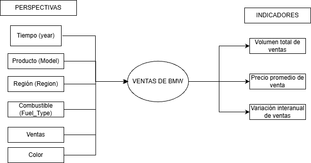

# Entrega Requerimientos: Ventas Vehículos BMW (2010-2024)

**Integrantes:** Santino Vazquez de Novoa, Enzo Parra, Santiago Dhers, Tomas Vogt

---

## 1. Presentación del tema y la fuente de datos

**Tema elegido:** Ventas de vehículos BMW a nivel global en un período de 2010 a 2024.

**Proceso de negocio a analizar:** Todos los años, BMW vende sus distintos modelos en mercados de todo el mundo, y cada venta atrae un montón de decisiones previas, como qué modelo se ofrece, con qué motor y combustible, qué transmisión, en qué color, a qué precio, y en qué región. Con el correr de los años esas decisiones van cambiando: la empresa lanza modelos nuevos, cambia los precios, potencia más la venta de los híbridos o eléctricos según la región; y el resultado de todo eso que queda debe ser resumido en cuánto se vendió y qué tan bien le fue a cada venta. Es decir, se deben clasificar las ventas en pos de impulsar ciertos mercados regionales que pueden no estar funcionando, encontrar patrones de compra en base a regiones y paso del tiempo, así como también cambios en los precios.

**Fuente del archivo:**
- **Portal:** Kaggle
- **Dataset:** *Comprehensive BMW Sales Records and Market Trends (2010–2024)*
- **URL:** https://www.kaggle.com/datasets/y0ussefkandil/bmw-sales2010-2024
- **Fecha de descarga:** 09/09/2026

**Descripción general del contenido:** el archivo contiene 50.000 registros de ventas de BMW entre 2010 y 2024, con información sobre el modelo vendido, el año, la región donde se vendió, el color, el tipo de combustible, el tipo de transmisión, el tamaño del motor, el kilometraje, el precio en dólares, el volumen de ventas y una clasificación de la venta.

---

## 2. Identificar preguntas

1. ¿Cómo cambió la mezcla de combustibles vendidos a lo largo de los años (combustión vs. híbrido vs. eléctrico)?
2. ¿Cuál es el precio promedio de venta por modelo y por año?
3. ¿Qué modelos "envejecieron" (perdieron ventas) y cuáles crecieron sostenidamente en el período analizado?
4. ¿Qué combinación de color + modelo es más popular en cada región?
5. ¿Cómo varía el precio promedio según región?

---

## 3. Indicadores y perspectivas

> En este paso se identifican los indicadores y perspectivas a nivel **conceptual** (qué se quiere medir y bajo qué ejes de análisis), sin referencia todavía a columnas ni fórmulas del archivo real — eso se resuelve recién en el Paso 2 ("Conformar indicadores" y "Establecer correspondencias").

### Pregunta 1: ¿Cómo cambió la mezcla de combustibles vendidos a lo largo de los años (combustión vs. híbrido vs. eléctrico)?

**Indicadores:**
- Volumen total de ventas
- Participación porcentual de cada tipo de combustible sobre el total del año

**Perspectivas:**
- Tiempo
- Combustible

### Pregunta 2: ¿Cuál es el precio promedio de venta por modelo y por año?

**Indicadores:**
- Precio promedio de venta

**Perspectivas:**
- Producto
- Tiempo

### Pregunta 3: ¿Qué modelos "envejecieron" (perdieron ventas) y cuáles crecieron sostenidamente en el período analizado?

**Indicadores:**
- Volumen total de ventas
- Variación interanual de ventas

**Perspectivas:**
- Producto
- Tiempo

> **Nota:** esta pregunta en realidad no agrega una perspectiva nueva respecto a la 2, sino que reutiliza Producto + Tiempo, pero el indicador es distinto: no es un promedio sino una variación calculada entre períodos.

### Pregunta 4: ¿Qué combinación de color + modelo es más popular en cada región?

**Indicadores:**
- Volumen total de ventas

**Perspectivas:**
- Producto
- Color
- Región

### Pregunta 5: ¿Cómo varía el precio promedio según región?

**Indicadores:**
- Precio promedio de venta

**Perspectivas:**
- Región

> **Nota:** perspectiva Tiempo opcional acá si quieren ver esa variación año a año también, pero la pregunta tal cual está redactada no lo pide explícitamente.

---

## Resumen

**Indicadores (3 en total):**
1. Volumen total de ventas
2. Precio promedio de venta
3. Variación interanual de ventas

**Perspectivas (5 en total):**
1. Tiempo
2. Producto (Modelo)
3. Región
4. Combustible
5. Color

---

## 4. Modelo conceptual

